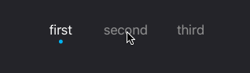

# DISegmentedView

Minimalistic segmented view with buttons as single segment. And dot indicator used to show which segment currently selected.

## Installation

### CocoaPods

Add `pod 'DISegmentedView'` to your Podfile. 

### Manual Installation

Just copy `DISegmentedView` class to your project.

## Requirements

- Xcode 7.0
- iOS 8.0+

## License

DISegmentedView is available under the Apache 2.0 license. See the LICENSE file for more info.